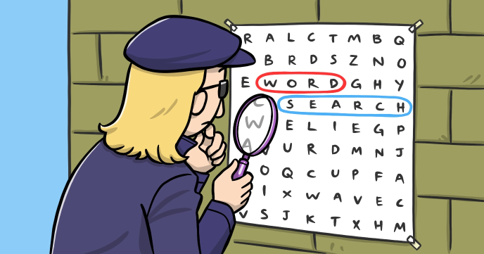

The Word Search game is so popular that entire magazines and booklets are dedicated to this game. In this program you’ll learn how to implement a Word Search game in JavaScript.

Suggestion: customize this game to your liking and make it display a secret message once all the words are found. Then share your program with your family and friends and ask them to resolve the puzzle if they want to see the message.

You’ll learn:

-	How to work with arrays and matrixes
-	How to implement multi-scene games
-	How to use the game loop
 
## Source code 
The JavaScript source code of this program can be found [here](sketches/program.js). To run it, you need to import it in the [codeguppy.com](https://codeguppy.com) online editor. Alternatively, you can use the source code in your p5.js sketches (advanced use). 
## Online version 
To see the code running, check the online playground at [https://codeguppy.com/code.html?t=word_search](https://codeguppy.com/code.html?t=word_search) 
## Next steps 
Please check [codeguppy.com](https://codeguppy.com) for many other fun JavaScript programs and games for beginners. To stay up to date with CodeGuppy development please follow [@codeguppy](https://twitter.com/codeguppy) on Twitter.  
